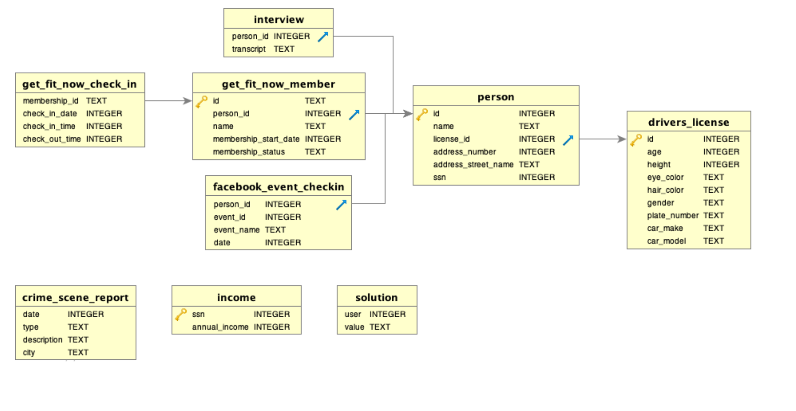

```{r, setup, echo=FALSE}
library(magrittr)
```

The following is a short murder mystery game which can be solved by using various functions and packages learned during the DDA intermediate R course.

The initial question is:

> You vaguely remember that a **​murder​** occurred sometime on ​**Jan.15, 2018** and that it took place in ​**R City​**. Find the killer.

The file structure is like this:



## Task 1 - Look at crime scene report

First one would need to look at the crime scene report for that given day.

#### Read data

```{r}
crime_scene_report <- vroom::vroom("raw-data/csv/crime_scene_report.csv")
```

#### Step 1 - View possible columns in Crime scene report

```{r}
# View columns
colnames(crime_scene_report)

```

#### Step 2 - Figure out how the date parameter is coded

```{r}
purrr::map(crime_scene_report, class)
# There are many possible ways to do this
    
```

#### Step 3 - Find descriptions for the day of the murder

```{r}
crime_scene_report %>% 
    dplyr::filter(date == "20180115" & 
                      type == "murder" &
                      city == "R City") %>%
    dplyr::select(description)
```

The following information is found doing this:

> "Security footage shows that there were 2 witnesses. The first witness lives at the last house on "Northwestern Dr". The second witness, named Annabel, lives somewhere on "Franklin Ave"."

## Task 2 - Find witnesses

#### Read data

```{r}
person <- vroom::vroom("raw-data/csv/person.csv")
```

#### Step 1 - Find the witnesses

One needs to look in the person table to find street names.

**First witness**

One knows that the first witness lives at the last house in "Northwestern Dr".

```{r}
person %>% 
    dplyr::filter(address_street_name == "Northwestern Dr") %>%
    dplyr::arrange(desc(address_number))
```

The witness must be "Morty Schapiro" with a ID of 14887.

#### **Second witness**

This one needs some regex (str_detect). Might be too difficult?

```{r}
person %>% 
    dplyr::filter(address_street_name == "Franklin Ave" &
                     stringr::str_detect(name, "Annabel"))

```

The second witness is Annabel Miller with an ID of 16371.

## Task 3 - Find witnesses

#### Read data

```{r}
# Function to read interview data
read_interview <- function(file_name)

# List files
interview_files <- fs::dir_ls(here::here("raw-data/csv/interviews/"))

# Read data
interviews <- purrr::map_dfr(interview_files, vroom::vroom, delim = ",", show_col_types = FALSE)
```

#### Step 5 - Find witness statements (Interviews)

First we need to look at the interview table to figure out which columns/variables it contains.

```{r}
dplyr::glimpse(interview)
```

We have person id from the person table. We can use this to extract the data we want.

**Witness 1 - Annabel Miller**

```{r}
interview %>% 
    dplyr::filter(person_id == 16371) %>%
    dplyr::select(transcript)
```

The transcript is as follows:

> I saw the murder happen, and I recognized the killer from my gym when I was working out last week on January the 9th.

We need to figure out who exercised on January the 9th.

**Witness 2 - Morty**

```{r}
interview %>% 
    dplyr::filter(person_id == 14887) %>%
    dplyr::select(transcript)
```

His interview said the following:

> I heard a gunshot and then saw a man run out. He had a "Get Fit Now Gym" bag. The membership number on the bag started with "48Z". Only gold members have those bags. The man got into a car with a plate that included "H42W".

This does not tell us much besides the fact that he was at Get fit now and a membership number. We might be able to use this afterwards.

#### Step 6 - Who was working out?

This next part might be tricky. One needs to combine the "get_fit_now_check_in" to be able to find out who worked out at that specific time.

From the initial data layout we know that "id" from "get_fit_now_member" is the same as "membership_id" from "get_fit_now_check_in". We need to do some column binding to figure out who was exercising at the time we are interested in.

We need to combine the "get_fit_now_check_in" and "get_fit_now_member".

```{r}
fitness_person_checkin_combined <- dplyr::left_join(x = get_fit_now_member, y = get_fit_now_check_in, by = c("id" = "membership_id"))
```

Next we need to look what happens on January the 9th.

```{r}
fitness_person_checkin_combined %>%
    dplyr::filter(check_in_date == 20180109 &
                      stringr::str_detect(id, "48Z"))
```

There are 2 possible people checked in at the same time as Annabel saw the killer. One of them must be the killer.

We need to investigate person_id 28819, 67318.

#### Step 7 - Car lookup

We want to see which cars matches the description of Morty.

First we must find the licence plate ID of the two persons.

```{r}
person %>%
    dplyr::filter(id %in% c(28819, 67318)) %>%
    dplyr::select(c(name, license_id))
```

Now we need to find the car and make of the two people.

```{r}
drivers_license %>%
    dplyr::filter(id %in% c(173289, 423327))
```

We could also combine the two columns to better be able to see whos who.

```{r}
dplyr::left_join(x = person, y = drivers_license, by = c("license_id" = "id")) %>%
    dplyr::filter(license_id %in% c(173289, 423327) &
                      stringr::str_detect(plate_number, "H42W")) 
```

The killer is Jeremy Bowers.

#### The end

This could be the end. There is however, a witness transcript from Jeremy Bowers that indicates that he is not the killer, potentially extending the exercise.

Another possibility to add complexity could be to pivot a table, so that the participants needs to pivot it back.
